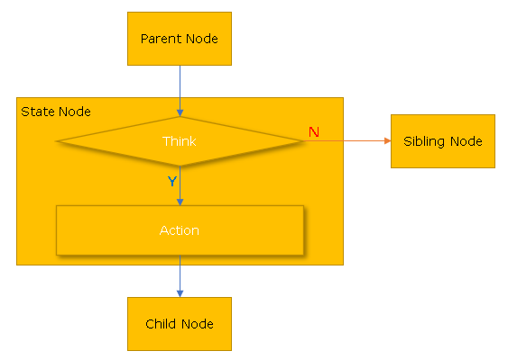
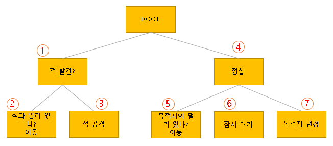

# FSM (Finite State Machine)

## 소개
FST(Finite State Machine/유한상태트리)는 게임에서 간단한 인공지능을 구현하기 위하여 개발 되었습니다.

보편적으로 많은 게임들이 초반에 FSM(유한상태기계)를 선택하지만, 오직 1개의 State만 가질 수 있는 특성상, State가 늘어날수록 유지보수, 확장, 재사용에 어려움이 많아 HFSM(Hierarchical Finite State Machine/State Charts) 또는 BT(Behavior Tree)도 많이 도입하는 추세입니다.

특히, BT는 유지보수, 확장, 재사용에서 큰 장점이 있지만 Composite Node 가 늘어날 수록 프로토타입이나 규모가 작은 게임에서 초기에 선택하기엔 너무 복잡했으며, FSM의 Transition 처럼 State의 변화를 알기 번거롭기 때문에 유니티에서 FSM 방식으로 구현된 Animation Controller와 연계하기도 어려운 점이 있었습니다.

따라서 BT의 의사결정 방식과 FSM의 State를 적당히 결합하여 FSM (Finite State Machine)이라는 의사결정/행동 매커니즘을 만들어 보았습니다.

## 동작방식

### Node의 구조

기본적인 Tree 구조이므로 Node가 존재하고, 이 노드는 State Node라고 불리며 다음과 같은 특징을 가지고 있습니다.



- 1개의 부모와 0~n개의 자식을 가질 수 있다.
- Think에서 의사 결정을 한다.
- Y를 결정하면, Action을 수행하고 첫째 자식 노드로 넘어간다.
- N을 결정하면, Action을 수행하지 않고 다음 형제 노드로 넘어간다.
- Think는 필수지만, Action은 없을 수 있다.

이 노드를 가지고 간단한 정찰 NPC의 행동을 만들어 보겠습니다.

### 노드 트리 구조



위 트리는 정찰 NPC가 적을 발견하면 적을 추적하여 공격하고, 적을 발견하지 않았다면 정찰 목적지로 이동하여 잠시 대기하고 다음 목적지로 이동하는 루틴입니다.

탐색 방향은 BT의 Selector와 유사한데, 일단 Root는 개념상으로만 존재한다고 생각하면 되고, 첫 질의는 무조건 (1)노드가 수행하게 됩니다. 적을 발견하면 Y조건이므로 자신의 Action을 수행하고 첫째 자식 노드에게 질의합니다. (2)노드의 Think에서 아직 적과 가까이 있지 않다면 Action에서 이동을 하게 됩니다. 적에게 가까워졌다면 (2)노드는 N를 판단하게 되고 (3)노드로 탐색하고 적을 공격합니다. (1)노드에서 적을 발견하지 못했다면 형제노드인 (4)노드로 탐색되어 정찰 시퀀스를 수행하게 됩니다.

### 사용법

현재 소스코드는 유니티에서 사용하기 위해 C#으로 개발되었으며, 아래와 같은 방식으로 사용할 수 있습니다. 아래 코드는 적이 가까이 있을 경우 공격 반경에 들 때까지 이동 후 공격하는 루틴을 구현한 예제입니다.

```csharp

    private FST fst;
 
    void Start()
    {
        fst = new FST(
            new FSTNode("Battle")
                .Think(_ =>
                {
                    if (Vector2.Distance(this.transform.position, player.transform.position) < 3)
                        return true;
                    return false;
                })
                .BeginAct(_ => { Debug.LogWarning($"전투시작!: {_.IsSelected}"); })
                .Act(_ => { Debug.Log($"전투중!: {_.IsSelected}"); })
                .EndAct(_ => { Debug.LogWarning($"전투끝!: {_.IsSelected}"); })
                .AddChildren(
                    new FSTNode("MoveTo")
                        .Think(_ => {
                            return Vector2.Distance(this.transform.position, player.transform.position) > 1;
                        })
                        .Act(_ => { MoveTo(player, 3); })
                        .EndAct(_ => { this.GetComponent<Rigidbody2D>().velocity = new Vector2(); }),
                    new FSTNode("Attack")
                        .Think(_ => {
                            Debug.Log($"어택!: {_.IsSelected}");
                            return true;
                        })
                )
        );
    }

    public void FixedUpdate()
    {
        fst.Think();
    }
```

FSTNode는 Chaining Method 방식으로 Think, Act, BeginAct, EndAct에 익명 메소드를 설정하거나 함수를 전달 할 수 있습니다. 이렇게 하면 현재 클래스의 멤버 변수를 쉽게 액세스 가능하기 때문에 보다 편하게 개발이 가능합니다. 

fst.Think()를 게임의 Tick 마다 실행해서 의사결정 및 행동을 반복하게 해야 합니다.

위의 코드에서 FSTNode("Battle") 노드의 Think() 에서 true를 반환하게 되면 FST는 현재의 상태(State)를 

``` /Battle ```

로 인식하고 "Battle"의 Act()를 실행한 후, 첫째 자식노드인 FSTNode("MoveTo") 에게 제어권을 넘깁니다. 다시 Think()에서 true를 반환하면 FST는 현재의 상태(State)를

``` /Battle/MoveTo ``` 

로 인식합니다. FSTNode("MoveTo").Think()가 false를 반환하면 제어권이 형제 노드로 넘어가기 때문에 FSTNode("Attack").Think()에서 다시 판단합니다. 여기서 true를 반환한다면 State는

``` /Battle/Attack ```

이 됩니다. 즉 Think()에서 true를 반환하는 노드만이 현재의 State로 인정되기 때문에, FSM과 달리 FST는 다중상태(Multiple States)를 가질 수 있게 됩니다.

상태를 가질 수 있다면 상태의 시작과 끝을 트리거하는 것도 중요합니다. 
FSTNode("MoveTo").Think()가 3번의 Tick마다 연속적으로 true를 반환 했다고 가정해 봅시다. 첫 번째 Tick에서 Act()가 실행되기 직전에 BeginAct()가 실행됩니다. 4번째 Tick에서 Think()가 false를 반환하면 EndAct()가 트리거 됩니다. 이 기능을 잘 활용하면 매 Tick마다 실행할 필요가 없는 이펙트나 Task를 BeginAct()에서 수행하고 EndAct()에서 리소스를 해지할 수 있습니다.

## 데모
TBD